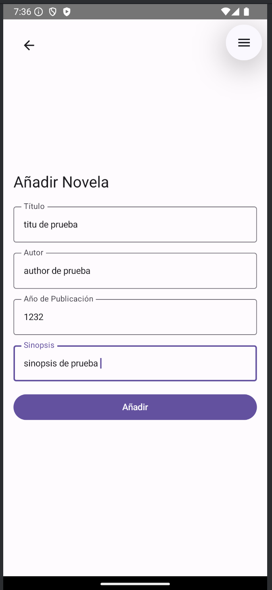
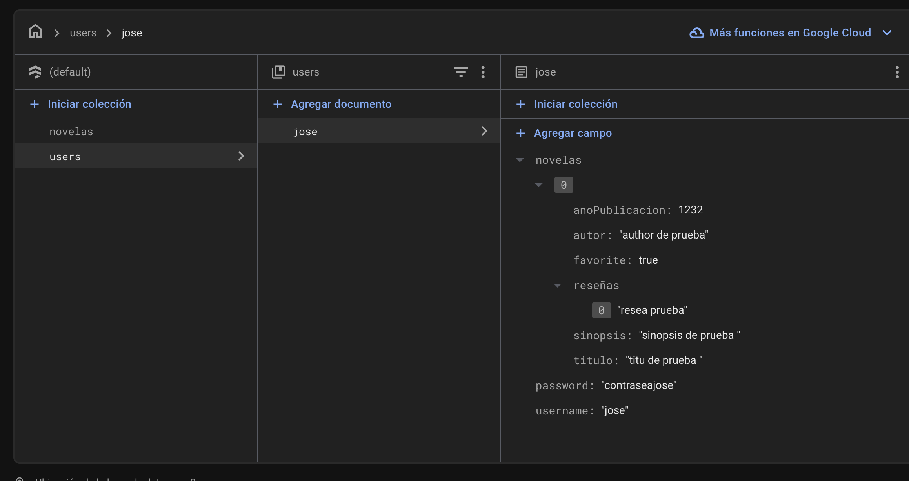
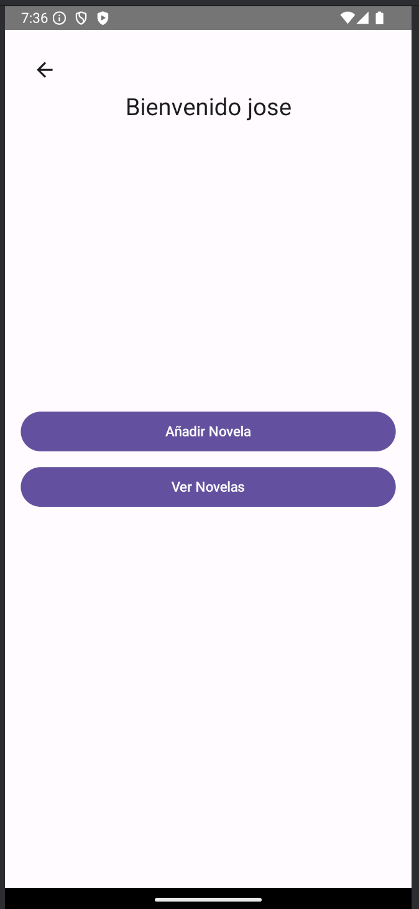
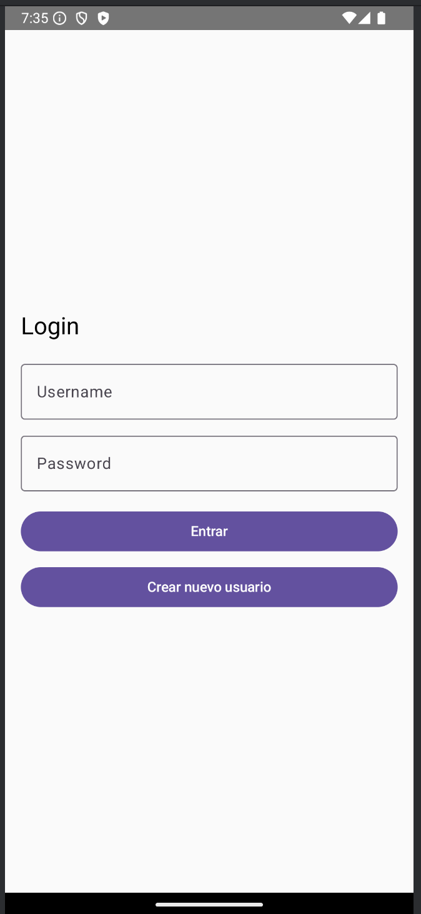

# Feedback1_Eventos - Segunda Entrega

## Enlace al Repositorio
[Repositorio en GitHub](https://github.com/jmartter/Feedback1_Eventos.git)

## Descripción
Este proyecto es una aplicación de Android que permite a los usuarios gestionar y visualizar novelas. En esta segunda entrega, se ha implementado la integración con Firebase para la gestión de usuarios y novelas.

## Ubicación del Código
El código de este proyecto se encuentra en la siguiente ruta:

`/app/src/main/java/com/example/feedback1_eventos/`

## Integración con Firebase
### Configuración de Firebase
1. **Firestore**: Se utiliza Firestore para almacenar la información de los usuarios y sus novelas.
2. **Autenticación**: Se gestiona la autenticación de usuarios mediante Firestore.

### Archivos Clave
#### `MainActivity.kt`
- Inicializa Firestore y navega a `LoginActivity`.

#### `LoginActivity.kt`
- Gestiona el inicio de sesión y el registro de usuarios utilizando `UserManager`.

#### `UserManager.kt`
- Contiene métodos para interactuar con Firestore, incluyendo:
  - `getUser`: Obtiene un usuario por nombre de usuario y contraseña.
  - `registerUser`: Registra un nuevo usuario.
  - `addNovelaToUser`: Añade una novela a un usuario.
  - `deleteNovelaFromUser`: Elimina una novela de un usuario.
  - `getNovelasForUser`: Obtiene las novelas de un usuario.
  - `toggleFavorite`: Marca o desmarca una novela como favorita.
  - `addReview`: Añade una reseña a una novela.

## Componentes Principales

### `LoginActivity.kt`
- **Clase `LoginActivity`**: Configura la pantalla de inicio de sesión y registro.
- **Función `LoginScreen`**: Define la UI de la pantalla de inicio de sesión.
- **Función `RegisterScreen`**: Define la UI de la pantalla de registro.

### `MenuUsuarioActivity.kt`
- **Clase `MenuUsuarioActivity`**: Configura la pantalla del menú de usuario.
- **Función `MenuUsuarioContent`**: Define la UI del contenido del menú de usuario.

### `AddNovelaScreen.kt`
- **Función `AddNovelaScreen`**: Define la UI para añadir una nueva novela.

### `ViewNovelasScreen.kt`
- **Función `ViewNovelasScreen`**: Define la UI para ver la lista de novelas.

### `ViewNovelaDetailScreen.kt`
- **Función `ViewNovelaDetailScreen`**: Define la UI para ver los detalles de una novela.

### `NovelOptionsDialog.kt`
- **Función `NovelOptionsDialog`**: Define un diálogo con opciones para una novela.

### `UserManager.kt`
- **Objeto `UserManager`**: Gestiona las operaciones relacionadas con los usuarios y las novelas en Firestore.

## Muestra de la Aplicación
<table>
  <tr>
    <th>AñadirNovela</th>
    <th>Nombre</th>
    <th>MuestraFire</th>
    <th>Muestra de Firebase</th>
    <th>Menu</th>
    <th>Información Novela</th>
    <th>Login</th>
  </tr>
  <tr>
    <td></td>
    <td></td>
    <td></td>
    <td></td>
    <td></td>
  </tr>
</table>